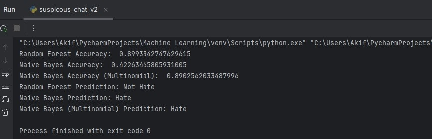
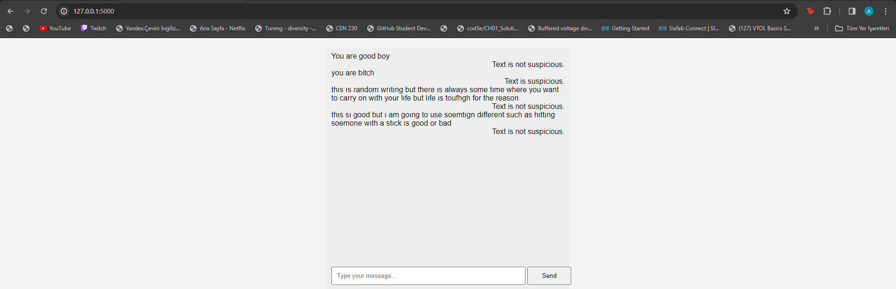

# CYBER SECURITY FINAL PROJECT REPORT

- [CYBER SECURITY FINAL PROJECT REPORT](#cyber-security-final-project-report)
  - [1. INTRODUCTION](#1-introduction)
  - [2. DATA ANALYSIS](#2-data-analysis)
  - [3. DATA PREPARATION AND PREPROCESSING](#3-data-preparation-and-preprocessing)
  - [4. MODEL DEVELOPMENT](#4-model-development)
    - [4.1 Model Selection](#41-model-selection)
    - [4.2  Pre-Trained Algorithm](#42--pre-trained-algorithm)
  - [5.  RESULTS](#5--results)
  - [6.  WEB SITE DEVELOPMENT](#6--web-site-development)

## 1. INTRODUCTION

* Our project is **“Active Chat Monitoring and Suspicious Chat Detection”**. This project was created to predict whether sentences entered on our website are suspicious or not.

* Project Objectives:
  *  **Data Set Analysis:** Conduct a detailed analysis of the "labeled_data.csv" dataset to understand its general characteristics.
  *  **Data Preprocessing:** Prepare the dataset for modeling by applying cleaning, preprocessing, and vectorization steps.
  *  **Model Development:** Utilize classification models such as Random Forest and Naive Bayes to identify hate speech in tweets.
  *  **Performance Evaluation:** Assess the models' success through accuracy scores, confusion matrices, and classification reports.

## 2. DATA ANALYSIS

* The dataset used in this project is taken from a CSV file named ["labeled_data.csv"](https://www.kaggle.com/datasets/mrmorj/hate-speech-and-offensive-language-dataset). The types of features in our dataset are count, hate_speech, offensive_language, neither, class, tweet. In the data analysis phase of our project, we examined the general characteristics of the dataset. There are 24,783 instances in total. With the clean_text() function, basic preprocessing steps were performed on the tweets in the dataset. These steps included removing special characters, lowercase conversion, removing stop words and roots.

## 3. DATA PREPARATION AND PREPROCESSING

* With the **preprocess()** function, the "class" column was handled separately using One-Hot Encoding on the dataset. Then, tweet contents were converted into numerical format using the Count Vectorization method.

* The dataset was then split into training and test sets. The training set was selected at 80% and the test set at 20%.

## 4. MODEL DEVELOPMENT
    
### 4.1 Model Selection

* In this phase of the project, we focused on developing and training classification models to effectively identify hate speech within tweets. Two main models were used for this task: Random Forest and Naive Bayes.
  * **Random Forest Model:**
    - We utilized a Random Forest classifier consisting of 10 decision trees, trained based on the 'entropy' criterion. This ensemble model was chosen for its capability to handle complex relationships within the data and make robust predictions.
  * **Naive Bayes Models:**
    - Two types of Naive Bayes models were employed — Gaussian Naive Bayes and Multinomial Naive Bayes.
        - **Gaussian Naive Bayes:** This model assumes that the features follow a Gaussian distribution. Despite its simplicity, it can be effective in certain scenarios.
        - **Multinomial Naive Bayes:** This variant is specifically tailored for discrete data, making it suitable for the count-based features obtained through vectorization.

### 4.2  Pre-Trained Algorithm

* The **save_model()** function is designed to train the dataset with the algorithm used and save it as a file. In this way, it was aimed to use the trained dataset for each text entered on the website without the need to train the model again and again. This also saved time. A more user-friendly website was achieved.

* The **load_model()** function loads the trained model saved with the save_model() function.

* The **'joblib'** library was used for these functions.

## 5.  RESULTS

* When the results obtained are analyzed, it is seen that the Random Forest model has the highest accuracy value. However, Naive Bayes accuracy is not bad. But the results are not always true (shown below).
    * Random Forest Accuracy: **89%**
    * Naive Bayes (Gaussian): **42%**
    * Naive Bayes (Multinomial): **89%**

        

## 6.  WEB SITE DEVELOPMENT

* The dataset used in this project consists of tweets with bad messages. We trained and tested the model with this dataset. While testing the algorithms, we first measured the accuracy of the model by manually entering the messages without connecting to the website. The outputs of the accuracy of the models are shown in picture shown above.

* In the last stage, we connected the website with the code we wrote. The text entered by the user in the text box is tested by the algorithm with the “Send” button. The prediction result is printed below the button. 
    
    

